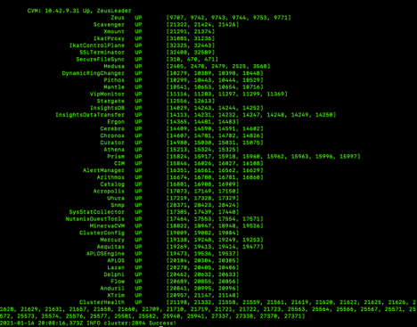

Controller Virtual Machine (CVM)
================================
Overview
--------
The CVM is at the heart of the Nutanix HCI solution, there’s one deployed per node and each communicates with the other CVMs as well as its local hypervisor.  The CVMs are responsible for all things storage as well as presenting a management interface to the administrator, a REST api for automation and a whole lot more.

You won’t regularly need to interact with the CVMs directly, sometimes though support may ask you to login to a CVM and execute a command or two.

There are two main methods of logging into a CVM, you can use the “open console” link within the management UI or you can use ssh (most administrators prefer this method).

In your environment the CVM will be a “regular” ESXi CentOS VM, that’s using standard VMware pass-thru drivers. It will own the local disks on the node.  In fact, it doesn’t matter what the hypervisor is (Nutanix AHV, Microsoft Hyper-V) there’s always a CVM present.

A very detailed discussion of the Nutanix (ESXi specific) architecture is here https://nutanixbible.com/#anchor-book-of-vsphere 

The Windows virtual worksations deployed to allow you access to the labs have an ssh client installed.  Simply open a command prompt and the type ssh nutanix@<CVM IP address>

Once logged into the CVM you will see a shell prompt similar to:
nutanix@NTNX-15SM65450323-A-CVM:10.42.9.29:~$ 

Connect to the CVM Console
--------------------------

Method 1 – SSH (Preferred)
Open a command prompt on your workstation and type ssh nutanix@<IP address of any CVM or the cluster’s VIP> (respond yes if there’s a “fingerprint” message).
- **Username:**  nutanix
- **Password:** <cluster pw>

Method 2 – Prism VM Console
Connect to Prism Element (aka PE, the Management UI)
Navigate to VM screen
In **Prism  > VM > Table tab**
Check “Include Controller VMs” above VM table
Highlight any of the CVMs
Click on “Launch Console” action (or right-click and select “Launch Console”

- **User name:**  nutanix
- **Password:** <cluster pw>

Run the following commands and observe the output:

**$ cluster status | more**

Status of all distributed services running on all nodes

**$ cluster status | grep CVM:**
Observe CVM UP on all nodes and one is the Zeus Leader

The Nutanix CLI (ncli) can be used to manage the Nutanix cluster.

**$ ncli help | more**

Shows all options available via ncli

**$ ncli cluster version**

shows Nutanix software version

**$ ncli host ls**

Shows details on all hosts in cluster (DSF Perspective)

**$ ncli vm list**

Shows details on all VMs in cluster (DSF Perspective)

CLI shortcuts exist to make cluster management a bit easier. Often, you need to execute a command on all CVMs, or on all ESXi hosts, rather than on just a single host. It would be tedious to log on to every system and enter the same command on each of them, especially in a large cluster. That's where the allssh and hostssh shortcuts come in. 

**allssh** takes a given command entered on the CVM BASH CLI and executes that command on every CVM in the cluster. 

**hostssh** works similarly, taking a command entered on the CVM BASH CLI and executing that command on every hypervisor host in the cluster

**$ allssh date**

Executes ‘date’ on every CVM and prints results to console

**$ hostssh date**

Executes ‘date’ on every ESXi host (node) and prints results to console

Hmmm!  Think about the difference between the two commands.

Here’s an example output of the “**$ cluster status**” command.  You can see all of the processes and services that make up the Nutanix solution.  There’s a lot of them as the CVM does a lot for you.  Many Nutanix services have names from Greek mythology – some are open-source names you may recognize – such as Cassandra (which Nutanix modified for enterprise class performance and behavior).  The output is shown for one CVM – when you ran the command you saw that it shows the output from each CVM in the cluster.

