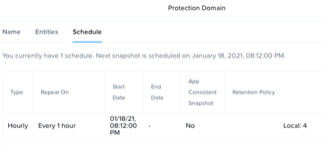
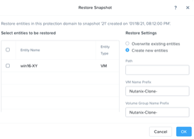

Data Protection
===============
Overview
--------
Learn how to set up protection domains, create VM snapshots, and restore data from those snapshots.

This lab is meant to be used by the Self Service Restore (SSR) Lab and is a pre-req for it.  If you want to perform the Self Service Restore Lab then go to that lab now and go as far as “create your data” before configuring and starting a Protection Domain (PD).

Data Protection
---------------
In Prism, data protection policies are called Protection Domains (PDs). A PD is made up of one or more VMs and a policy. The available policies include snapshots, replication locations, and scheduled VM snapshots.  You don’t have to use PDs, at any-time on an ad-hoc basis you can take a snapshot of a VM or clone it, via Prism or programmatically.
Configure a Protection Domain.

- In **Prism > Data Protection, click Data Protection, then click Table**.
- Click **+ Protection Domain** to create a PD, then **click Async DR**.
- Provide a name for the PD, and click **Create** (eg. PD-your-initials)
- Select the VM that you want be members of the PD (your Windows VM):
- Scroll down and click **Protect Selected Entities**.
- The selected VMs appear in the right-hand side table. Click **Next**.
- Configure a local schedule:
- Click **New Schedule**.
- Select a frequency, choose every **1 hour** (for the purposes of this lab do not choose any other frequency).
- Configure a retention policy: Set the retention policy (for example, keep the last four snapshots).

.. note:: 
   Local is the only option in this lab environment because no remote targets are configured.
   (You could setup a remote site with a neighbor cluster).

- Click Create Schedule.

A Protection Domain can have multiple schedules.

 
Click Close to exit.

(At this point you can delete you created data if you’re performing the Self Service Restore lab).

If you go to the Data Protection screen and select the Table tab you can see the Protection Domain and clicking Local Snapshots shows you that one has been taken – over on the right (of snapshot id #21) you can see that there’s a Details and a Restore link – clicking on the Restore link brings up an interesting wizard  

If you have time come back to this wizard later!

Takeaways
---------
- Nutanix offers data protection solutions for virtual datacenters via different strategies including one-to-one or one-to-many replication.
- Nutanix provides data protection functions at the VM, file, and volume group (iSCSI volumes) level, so VMs and data remain safe in a crash-consistent (or application consistent where supported) environment.
- You can implement a data protection strategy by configuring protection domains and remote sites through the web console.
