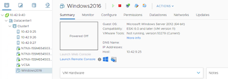
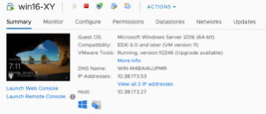

Deploying Workloads
===================
Overview
--------
Learn about basic VM deployment.

You already know how to use vCenter to deploy and manage VMs, in fact almost of your knowledge is still applicable.

You can manage vCenter VMs from Prism Element, I recommend creating the VM via vCenter in the first place. If you deploy a VM from vCenter it appears in PE and vice-versa.  You can open a console to a VM in PE and perform power operations – you can also mount VM Tools via PE.

This lab will get you to deploy a Windows VM via vCenter and then have a look at what you can do to manage it via PE.

.. note::

   After a VM is created via VMware vSphere, it appears in the Prism VMs list.
   Conversley, if a VM is created via Prism, it appears in the VMware vSphere UI. An example is shown in the image below.
   

Go to vCenter and look for Templates, there’s one for Windows and one for Linux (CentOS).  

vCenter Credentials:
- User Name: administrator@vsphere.local
- Password: <vCenter_admin_password>

Windows VM Credentials:
- User Name: administrator
- Password: nutanix/4u

CentOS VM Credentials:
- User Name: nutanix
- Password: nutanix/4u
The CentOS VM also has a root user with the same password as the nutanix user (the latter is also able to sudo).

Use the workflow you are familiar with in vCenter to deploy a VM from your chosen template:

- **VM Name:** win16-XY (or cen7-XY) where XY are your initials
- **vCPU:** 2
- **vRAM:** 4GiB
- **Network:** VM Network

Select storage: choose the container in Nutanix (datastore in vCenter) you created earlier: eg. container-XY)

Choose to power it on.

Our Windows template is not syprep’d so we don’t need an answers file and we won’t be working with AD.  Both templates have VM Tools installed.

Here’s a screen shot from vCenter showing a Windows VM called win16-XY

