How to login to your VDI workstation with Nutanix Frame
=======================================================

1 Enter https://console.nutanix.com/x/labs In your HTML5 enabled browser

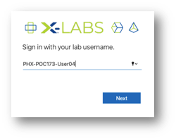

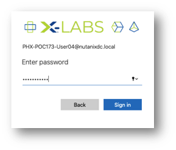

2 Once logged in you will see a landing page with a PC icon

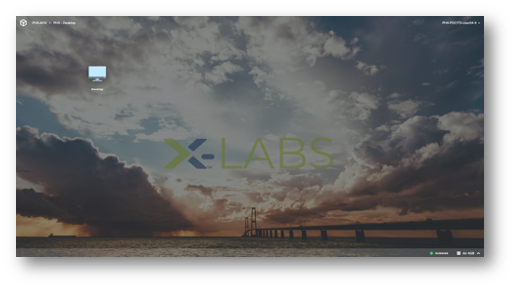

3 Click that icon

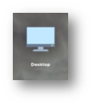

4 You will see status messages

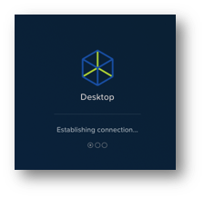

5 After short time you will see your virtual desktop

6 Double click on the Chrome icon, ignore any access warnings – for chrome select Advanced and then the Proceed link at the bottom.

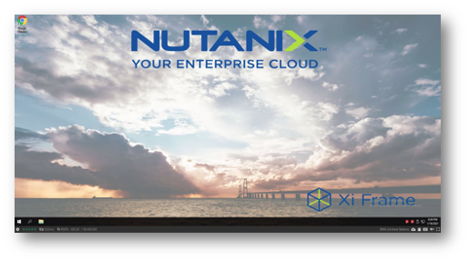

From this point when you enter an IP address you need to use the ones from **your assigned Nutanix Cluster/vCenter**.

7 In the browser enter the ip address of Prism Element (aka Prism) – here you can see we used 10.38.173.37

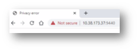

8  Ignore / overide any certificate warnings

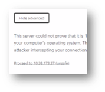

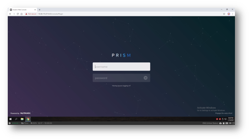

9 Open another browser tab and then enter the IP address for vCenter access, here we use 10.38.173.40 and additionally select the HTML5 option

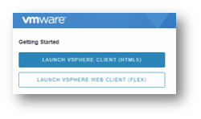

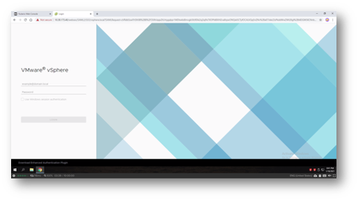

You’re ready to start the labs now!