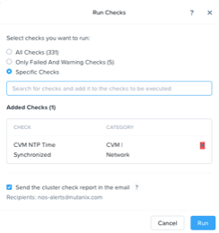
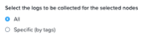
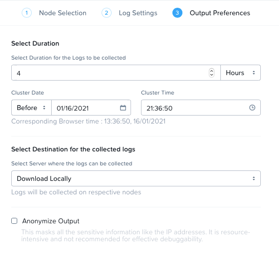

Health, NCC and Logs
====================
Overview
--------
First let’s discuss Nutanix Cluster Check (NCC).  The NCC utility is central to monitoring the health of the Nutanix cluster.  It features dozens of individual health checks that are run periodically – these checks monitor everything from time synchronization to how full disks are. 

NCC can be run via Prism or via the command line by logging into any CVM.

Support may ask you to run NCC, perhaps the whole suite or an individual check.  Other utilities such as Lifecycle Manager (LCM) and the Upgrade workflow run NCC to make sure nothing needs attention before any kind of upgrade – for AOS or the hypervisor for example.

The other thing that support may ask you for are the Nutanix logs, again these can be obtained via PE or the CVM command line.  We will look at both methods for all of these things.

The main PE landing screen show you a summary of the cluster’s health

 
You can see a scroll bar in that box – scrolling shows you additional health summaries for eg. storage containers.

Let’s have a tour now (please follow along on your cluster) – your cluster won’t show exactly what’s shown here – the idea is to have a tour and see what you can see.

Open https://<NUTANIX-CLUSTER-IP>:9440
Fill out the following fields and click Enter:
•	Username – admin
•	Password - HPOC Password
At this point you can choose a guided tutorial or go with the detailed overview, since the Health screens can seem like a lot initially you should take the guided Health tutorial first.  To do this click Health Tutorial from the ? drop-down at top-right-ish.
 

The tutorial starts, keep clicking next and read along – only take 3 minutes!

For a more detailed tour carry in with the next section.

Now carry on with a more detailed look.

From the Menu pull-down select Health

 
You can see that there are Critical (Red), Warning (Yellow) and all good (Green) items displayed.  For almost all items you can double-click on them and start to dive down into the issues.

You can hover over a “color” and a pop up will appear, for example:

 
Click on the red bar (remember your system will not look exactly the same – choose something and click!)

Over on the right this panel is displayed:

 
Hovering over the ‘Failed’ item shows

 
Clicking on it takes you to

 
Clicking on it shows you:

 
We can see some history and over on the right the panel shows us useful information and a link

 
Clicking on the blue “Related Nutanix Knowledge Base (KB) link takes us to public support documentation (in a new tab) that discusses how to fix this issue and possible causes (complete page not shown)

We can go back to the main Health page and then click the crosses on the filters

 
The right side now shows

 
You can scroll down the list of checks that NCC could run, it’s a long list.  Hovering over a check turns it blue – you can then click and be taken to a summary of when that check ran and any issues – if in doubt click!

If you click on the Actions pull-down you get

.. figure:: images/16.png
 
Selecting Run NCC Checks get you

 
There’s no issue with sending the email to Nutanix – support use ML to spot trends and issues and the ML may even open a Support Case on your behalf – it’s proactive and part of the service.
If you choose Specific Checks you can choose which ones you want to run.

Running ALL checks can take a while to execute.

Here we pick an NTP check

 
And run it
Then if we go to the Tasks page we can see the status – here we click on the blue “Succeeded” link

 
You can see a download link if you want to save the output / send to Nutanix / keep for audit.
Lastly, let’s look at generating and downloading logs
From the main Health page select the Actions pull down over at top right

 
Then select Collect Logs
A wizard appears and you can now select which nodes to collect from, log settings and output options
 

 
Click the +Select Nodes

Select All logs

Leave the Duration at the 4 hours (this should be the default)

Selecting “Destination for the collected logs” pull-down shows

 
We will go for a local download, click the Collect button  

A message appears

 
If we display all tasks by using the pull down at the top

 
We see the Log Collector task running

 
Once it has completed, we simply click on the blue Succeeded link, the browser will let us download a zip file, eg
NTNX-Log-2021-01-16-1610833185-39774-PE.zip

Running NCC from the CVM command line

Login to any CVM (or VIP) – please see the CVM Lab for guidance

Type
nutanix@cvm$ ncc health_checks run_all
which will run all 600+ checks or you can run individual checks or a set of check – here’s how to run the networking checks and associated output

Sample output::

    nutanix@NTNX-15SM65450323-A-CVM $ ncc health_checks network_checks
    +----------------------------------------------------------------------------------------------------------------------+
    | Type | Name                                 | Impact        | Short help                                             |
    +----------------------------------------------------------------------------------------------------------------------+
    | P    | 10gbe_check                          | Non-Intrusive | Checks if 10GB ethernet NIC is being used correctly    |
    | P    | check_dvs_esxi_version_compatibility | Non-Intrusive | Check if DVS is being used on an affected ESXi version |
    |      |                                      |               | - ESXi 6.0GA,U1,U2,U3 and 6.5GA                        |
    | P    | check_network_segmentation_enabled   | Non-Intrusive | Check if network segmentation enabled on cluster with  |
    |      |                                      |               | AOS less then 5.5                                      |
    | P    | check_network_switch                 | Non-Intrusive | Checks if network switches are configured properly.    |
    | P    | check_ntp                            | Non-Intrusive | Checks if NTP is configured and syncing correctly.     |
    | P    | check_unsupported_sfp                | Non-Intrusive | Checks if unsupported SFP is plugged in.               |
    | P    | cvm_dvportgroup_binding_check        | Non-Intrusive | Recommends static binding against ephemeral binding    |
    |      |                                      |               | for dvPortGroups                                       |
    | P    | cvm_mtu_check                        | Non-Intrusive | Checks if CVM MTU is set properly.                     |
    | P    | cvm_mtu_uniformity_check             | Non-Intrusive | Checks that each CVM's management interface has the    |
    |      |                                      |               | same MTU                                               |
    | P    | cvm_time_drift_check                 | Non-Intrusive | Checks if the time drift between CVMs is less than the |
    |      |                                      |               | 3 seconds.                                             |
    | P    | duplicate_cvm_ip_check               | Non-Intrusive | Checks if CVM IPs have been duplicated in the network. |
    | P    | duplicate_hypervisor_ip_check        | Non-Intrusive | Checks if Hypervisor IPs have been duplicated in the   |
    |      |                                      |               | network.                                               |
    | P    | ha_py_rerouting_check                | Non-Intrusive | Checks if that ha.py rerouting is not engaged          |
    | P    | help_opts                            | Non-Intrusive | Show various options for this module.                  |
    | P    | host_cvm_subnets_check               | Non-Intrusive | Checks if host and CVM share the same subnet           |
    | P    | host_nic_error_check                 | Non-Intrusive | Checks if each NIC has fewer than 1.000000% crc errors |
    |      |                                      |               | and 1.000000% rx missed errors during span of          |
    |      |                                      |               | execution of (3600 seconds).                           |
    | P    | host_pingable_check                  | Non-Intrusive | Checks if all host ips are pingable                    |
    | P    | inter_cvm_connections_check          | Non-Intrusive | Checks if all CVMs are reachable via ping              |
    | P    | inter_cvm_ping_latency_check         | Non-Intrusive | Checks ping times between CVMs                         |
    | P    | mellanox_nic_driver_version_check    | Non-Intrusive | Checks if Mellanox port NIC driver version is above    |
    |      |                                      |               | min recommended version                                |
    | P    | mellanox_nic_mixed_family_check      | Non-Intrusive | Checks Mellanox NIC Family                             |
    | P    | mellanox_nic_status_check            | Non-Intrusive | Checks Mellanox NIC Status                             |
    | P    | ndp_check                            | Non-Intrusive | Checks if the NDP(Nutanix Discovery Protocol) works in |
    |      |                                      |               | the cvm external network                               |
    | P    | nic_flaps_check                      | Non-Intrusive | Checks if any nic is flapping.                         |
    | P    | nic_link_down_check                  | Non-Intrusive | Checks if any nic is down.                             |
    | P    | ns_config_consistency_check          | Non-Intrusive | Checks if host bridge/vswitch configuration matches NS |
    |      |                                      |               | config in zookeeper                                    |
    | P    | quad_nic_driver_version_check        | Non-Intrusive | Checks if Quad port NIC driver version is above min    |
    |      |                                      |               | recommended version                                    |
    | M    | switch_checks                        | N/A           | Network switch related checks                          |
    | P    | zeus_config_ip_address_check         | Non-Intrusive | Checks if CVM/Hypervisor/IPMI IP addresses are in sync |
    |      |                                      |               | with zeus configuration                                |
    | P    | run_all                              | Non-Intrusive | Run all non-intrusive plugins in this module           |
    +----------------------------------------------------------------------------------------------------------------------+
    nutanix@NTNX-15SM65450323-A-CVM:10.42.9.29:~$

Depending on the size of your cluster, this command may take 30 minutes to complete execution (if you use the run_all option). During this execution, you will see a series of checks and statuses in the terminal window. This output is saved to a file after the NCC is complete.

Once the NCC check completes, the following message is displayed. ::

    Plugin output is written to /home/nutanix/data/logs/ncc-output-latest.log
    If required you can upload this file to the Nutanix support sftp server, if Windows is your workstation 
    then use a tool like WinSCP to do this.  
    
Target Nutanix sftp servers and full instructions are always provided whenever you open a Nutanix Support Request (SR)
    
This KB article describes the process in detail with screenshots for Macs and Windows https://portal.nutanix.com/page/documents/kbs/details?targetId=kA032000000986SCAQ
  

