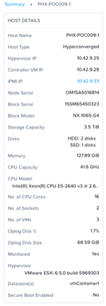
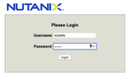
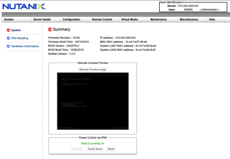
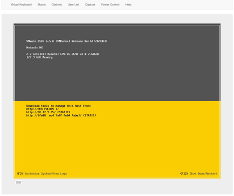
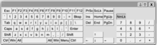
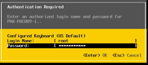
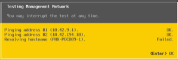

IPMI for Out-of-Band Management
===============================

Overview
--------
We cover how to get to the console of your Nutanix nodes, which of course are ESXi servers.

Nutanix NX hardware uses the Intelligent Platform Management Interface (IPMI) to allow for out of band management.  Other vendors may use iLO or iDRAC for example.  IPMI allows you to get to the console of your NX node (server) via a separate, typically 1GB copper RJ45 type Ethernet connection.

In this lab you will login to the IPMI KVM and issue a command to ESXi, we won’t use Java or any special client software – just our HTML5 enabled browser and an IP address.

You will need the IP address of the IPMI for any of the nodes that make up your Nutanix cluster – these IP addresses are outlined by the instructor.

Do you remember how to get the Host (node), CVM and IPMI IPs for your nodes via Prism?  From PE select Hardware from the pull-down at top left-ish of the main landing page -> Click Diagram -> Click on any node in the diagram and the bottom left panel displays the details you need and much more.  You will see that the IPMI IP is a blue link – so you can simply click on it to be taken to the IPMI login prompt.
 
**NB:** Please do not power off/reset nodes during this lab, be creful as you will have full admin access.

Here’s an example

 
In your browser type http://<IPMI IP> and login using
- **Username:** ADMIN
- **Password:** <IPMI ADMIN password>
 

Ignore any Java update message by clicking Cancel – you may see other messages depending on your browser – they can be ignored / cancelled.

 
You will be greeted with a screen like
 

You can probably just make out the ESXi summary screen in the Remote Console Preview – it’s faint as it’s in the screen dim state.

Along the top click Remote Console and select iKVM/HTML5

 .. figure:: images/5.png 

Then click the iKVM/HTML5 button

 
You will then see

 
The screen is now no longer dimmed this is because the cursor was placed within and a key depressed.
You can bring up a virtual keyboard by clicking the tiny keyboard icon at bottom left

 
You don’t usually need the virtual keyboard, your workstation keyboard should work just fine as long as the console window has focus.
Hitting F2 gets you a login screen

 
Credentials to use are:
- **Login Name:** root
- **Password:** <ESXi Host root password>

Select Test Management Network

Then OK

OK again and ESC to logout

Go ahead and explore what other things you can do via IPMI and what information it can tell you. 

Here’s a capture of the menu bar fyi

 .. figure:: images/12.png 

