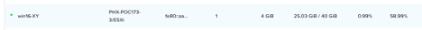
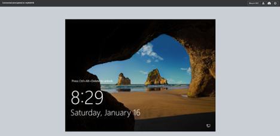

Managing Workloads
==================
Overview
--------
Get experience using VM management tasks from Prism, which include power actions, searching, snapshots and cloning.

Workload Management
-------------------
Now that you have at least one VM deployed, let’s explore what you can do with the vCenter VM but via Prism.

Explore VM power actions and console access.
In **Prism Element  > VM Select Table tab**.

Locate the VM you created in the previous lab (win16-XY or cent7-XY).

.. note::
   The Power State indicator next to the name of the VM may show a red dot, indicating that the VM is powered off.

Now let’s power on the VM (if it’s Off):

Select the VM, a row of allowed Actions appears towards the bottom of the box where the VMs are listed (you can also right click on the VM Name) – select power options and power on if necessary) then  let’s open a console to the VM.  Just select Launch Console (which you can only do if the VM is powered On).

This is the VM Table view

You could type “win16-XY” in the filter box over on the right.  

 
To narrow down what your looking for.

Towards the mid-bottom of the screen you can see the operations you can perform for this VM

So, you don’t need to do everything from vCenter – you have options.

.. note::
   
   See the list of available actions (Update, Delete, Clone, Launch Console, Power On, Suspend). Note that Launch Console can be shaded. This action is not available if the VM is off.
 

Opening a console:

.. note::
   When the console window opens, note that there are actions available in the console (Send CTRL-ALT-DEL, Take Screen Capture, and Power).  Mount ISO is not supported for ESXi VMs.
   Power On in the Actions menu changes to Power Off once the VM has been powered on. You can also click on the name of the VM to open a console window for a specific VM. This console window contains all of the options available under the Actions menu, performance-related information, and other relevant VM details.

