.. Adding labels to the beginning of your lab is helpful for linking to the lab from other pages
.. _nutanixTechOverviewLab:

-------------------------
Nutanix Tech Overview Lab
-------------------------

Overview
++++++++

This lab will introduce you to Prism Element and familiarizes you with its layout and navigation.

Prism Element
+++++++++++++

From the web browser, log into the Nutanix Prism UI using the Cluster IP.  Using the Cluster IP (aka Virtual IP or VIP) will route you through to one of the CVMs – you could use the IP of any of the CVMs to get to the same UI.

Open https://<NUTANIX-CLUSTER-IP>:9440

Fill out the following fields and click Enter (use the Prism UI Credentials for the Nutanix cluster assigned to you):

- Username: admin
- Password: <Prism/UI admin password)

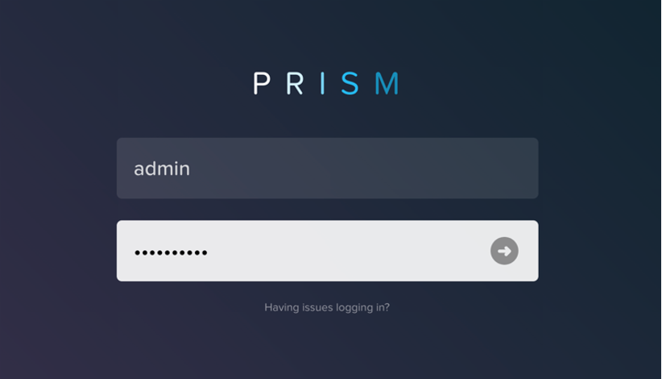

After you log in to Prism Element, familiarize yourself with the Prism UI. Explore the information on the Home screen, as well as the other screens.

Main Home screen informational areas:
- Summary
- Storage Summary
- VM Summary
- Hardware Summary (how many ESXi hosts – make up this cluster?)
- Cluster-wide Stats
- Health
- Alerts
- Data Resiliency (this should always be OK)

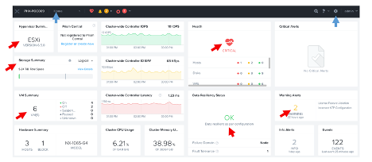

Review the UI navigation options (the pull-down by Home towards the top left of the screen).

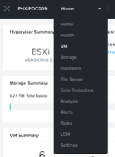

The main functions of each of these areas is summarized:

- **Home** main landing screen
- **Health** monitor and analyze the health of your system, run checks and collect logs
- **VM** monitor and manage VMs
- **Hardware** deployed hardware details
- **File Server** deploy and Manage a multi-protocol SMB/NFS file server
- **Data Protection** snapshots, remote replication 
- **Analysis** dig deeper into how the system is working
- **Alerts** find out what needs attention
- **Tasks** what’s the status of jobs/tasks being asked of the system
- **LCM** Lifecycle Manager – upgrade all system hardware and software such as disk drive firmware, BMC, BIOS and the hypervisor
- **Settings** NTP, DNS, local users and more

The pull down at top right-ish is also useful

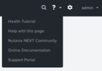

As is the pull down on your login name (admin)

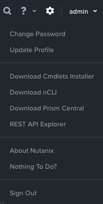

Examine the cluster hardware by using the navigation menu and go to the Hardware screen.
In **Prism > Hardware, click Hardware**, then **click Diagram**.
Review the hardware summary information:

- Blocks (a physical unit that can hold 1 to 4 nodes, depending on model)
- Hosts (virtualization servers, in our case ESXi servers, also known as nodes)
- Memory
- CPU
- Disks

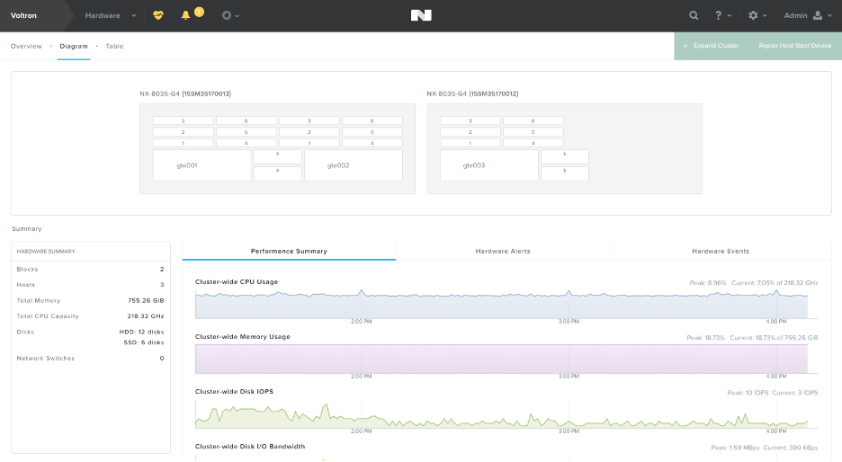

You can go have a look at the other management areas, such as Storage, by making a slection from the pull-down at top left-ish.

Prism Element UI Review
+++++++++++++++++++++++

Where would you locate the version of AOS you are running? Acropolis OS (AOS) is the heart of the Nutanix system.

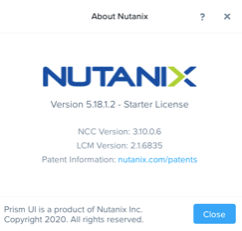

You can do this by clicking on the User drop down, and clicking **About Nutanix**.

How would you get to the following screen to view a summary of the number of hosts (or nodes) and the resource capacity and current utilization?

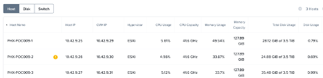

In **Prism > Hardware, click Hardware, then click Table**.

How would you get the following screen to see the health of your cluster?

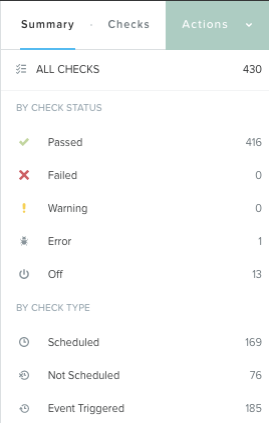

In **Prism > Health, click Health**, then **click Summary** in the right pane.

What page would show you the latest activity in the system? On this page, you can monitor the progress of any task and keep track of what has been done in the past using time stamps. Can you figure out two different ways to get there?

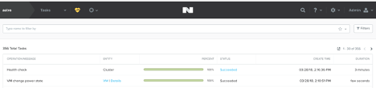

First Way, In **Prism > Tasks, click Tasks**. Second Way, click the pull-down by the circle at top left-ish and select **View All Tasks**

.. note:: The storage containers created in Prism appear as datastores in vCenter.

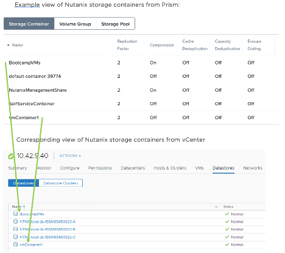

.. note:: vCenter Server instances can be registered to Prism via Settings.
   Registering a Nutanix Cluster running ESXi with vCenter allows you to perform core VM management operations (such as powering on/off a VM) directly from Prism without switching to vCenter Server.
   
   The vCenter Server that is managing the hosts in the cluster is auto-discovered and its IP address is auto-populated in the Address field as shown in the example below.

Example view of vCenter registration to Prism:

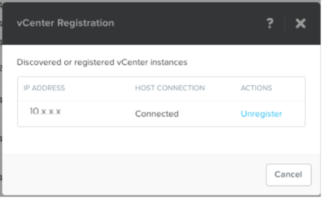

Your vCenter cluster is already registered with Prism.

Takeaways
+++++++++

- The default cluster redundancy factor is set to 2. Clusters with a redundancy factor of 2 have about 1/2 of the total raw disk space as useable  (30 TB raw ~ 15 TB usable space) because there are two copies of the data kept.
- A ZooKeeper failures tolerable of 1 means that one component in the cluster (one CVM, one NIC, one disk, and so on) can be down without impacting data resiliency. A failures tolerable of 2 means two components in the cluster can be down without impacting data resiliency. The two components can be different types.