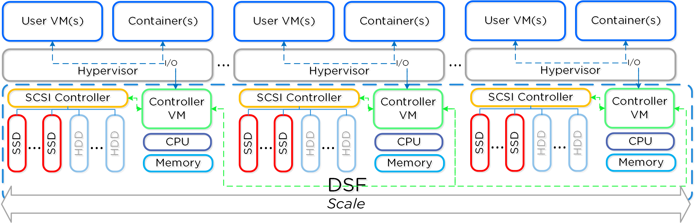

Configuring vCenter/ESXi for Nutanix
====================================

Overview
--------
The Acropolis OS (AOS) is essentially the Nutanix solution, as you know by now AOS runs in every Contoller VM (CVM) in the Nutanix cluster.

DSF is the Distributed Storage Fabric.

Each CVM is a CentOS VM and is a standard ESXi user space VM, all the CVMs communicate with each other to provide storage (and other) services to the 
collective ESXi servers managed by vCenter.  

You should regard the Nutanix cluster as a *distributed application*, as such it is designed to manage I/O, data management, protection and ancialliary services such as API 
services.  It also assumes responsibility and management for recovery from failures both hardware and software.

All this means that although "standard" as far as vSphere is concerned, nonetheless, there are considerations for implementing AOS in a vSphere environment.

For example, the CVMs boot from local storage on the node (ESXi server) they reside on, you do not protect them with vSphere HA.
Remember, AOS is a distributed application - so "it" takes care of HA of itself.  If a CVM fails on a node then re-assigment of network handles to other CVMs happens
automatically and VMs on a node with a failed CVM carry on transparently.

Bear this in mind as we summarise vSphere Cluster settings:

vSphere HA Settings
-------------------
- Enable host monitoring.
- Enable admission control and use the percentage-based policy, with a value based on the number of nodes in the cluster. For more information about settings of percentage of cluster resources reserved as failover spare capacity, see the vSphere HA Admission Control Settings for Nutanix Environment in the manual linked to later.
- Set the VM Restart Priority of all Controller VMs to Disabled.
- Set the Host Isolation Response of the cluster to Power Off.
- Set the Host Isolation Response of all Controller VMs to Disabled.
- Set the VM Monitoring for all Controller VMs to Disabled.
- Enable Datastore Heartbeating by clicking Select only from my preferred datastores and choosing the Nutanix NFS datastore. If the cluster has only one datastore, add an advanced option nameddas.ignoreInsufficientHbDatastore with Value of true.

vSphere DRS Settings
--------------------
- Set the Automation Level on all Controller VMs to Disabled.
- Leave power management disabled (set to Off).

Other Cluster Settings
----------------------
- Store VM swapfiles in the same directory as the virtual machine.
- Enable EVC in the cluster.

.. note::
   Since Nutanix is a distributed application it's important to understand (as with all applications) the shutdown and startup ordering
   follows a set order, consideration must be given to how many nodes (and therefore CVMs) are taken offline, for eg. maintenance of a node.
   Typically this is one CVM/node - Nutanix upgrade orchestration takes care of this for you.  You should exercise care when preforming manual operations.

This manual discusses the configuratoin process in detail.  This is for AOS 5.18, use the once specific to your version of AOS.

https://portal.nutanix.com/page/documents/details?targetId=vSphere-Admin6-AOS-v5_18:vSphere-Admin6-AOS-v5_18

A Video walk thru of the configuration procedures
-------------------------------------------------
The whole process is demonstrated on a video here by a Nutanix Systems Engineer walking you through how to configure vCenter for Nutanix.

.. raw:: html

   <iframe width="560" height="315" src="https://www.youtube.com/embed/D_xQ-rHXChc" frameborder="0" allow="accelerometer; autoplay; 
   clipboard-write; encrypted-media; gyroscope; picture-in-picture" allowfullscreen></iframe>

.. note:: Software versions may vary - the overall process doesn't change significantly.