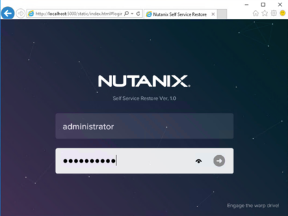

Self Service Restore (SSR)
==========================
Overview 
--------
This lab links Nutanix data protection services and VM operations.

SSR is just one example, the Nutanix platform offers a lot of choice in how your data is protected, locally or remotely.

The Self Service Restore (also known as file-level restore) feature allows virtual machine administrators to do a self-service recovery from the Nutanix data protection snapshots with minimal administrator intervention.

The Nutanix administrator should deploy Nutanix Guest Tools (NGT) in the VM and then enable this feature. For more information about enabling and mounting NGT, see Enabling and Mounting Nutanix Guest Tools in the Prism Web Console Guide. 

After the feature is enabled and a disk is attached by the guest VM administrators by logging into the VM, the guest VM administrator can recover files within the guest operating system.

The Lab uses a Windows VM as the protected source, should you wish to use a Linux (CentOS) VM then the process is similar: here’s two doc links that take you through the process on Linux – you have access to a CentOS7 template in vCenter – go for it!

https://support-portal.nutanix.com/page/documents/details?targetId=Prism-Element-Data-Protection-Guide-v5_18:man-restore-self-service-linux-c.html 

https://portal.nutanix.com/page/documents/details?targetId=Web-Console-Guide-Prism-v5_18:man-nutanix-guest-tool-configuration-linux-t.html 

In overview here’s what you need to do in this Lab **the order of operations is important**
#Deploy a Windows Server 2016 VM from a vCenter template (You should have already done this in one of the early labs).
#Install and Enable Nutanix Guest Tools (NGT) in the VM (a bit like VM Tools).
#Create some Data in the VM (a simple file on the administrator’s Desktop will do it).
#Configure and start a Protection Domain to snapshot the VM every hour (this you do in another Lab, you protect the VM from Step 1).
#Delete your data from step 3 (YES DELETE! But only of you have an active Protection Domain configured - please see the last lab).
#Start the SSR application in the VM

Login details (make sure the Nutanix Self Service Restore tab in the browser is selected!)
- **Username:** administrator
- **Password:** nutanix/4u

#Mount the snapshot as a Windows drive, eg. F: (the application will choose the drive letter for you)
#Find your file in eg. F:\Users\Administrator\Desktop\... and copy or drag-n-drop onto the Administrator’s Desktop

 

Here are the steps you should perform now:

.. note:: Configure the Protection Domain after you have deployed the VM, installed Nutanix Guest Tools and created your data].

1: Install Nutanix Guest Tools (NGT) in your VM
From Prism got to the VM screen and then right-click the name of your VM and choose Manage VM Guest Tools

 
Check mark Enable Nutanix Guest Tools, then check Mount Nutanix Guest Tools and Self Service Restore (SSR)

 
(You can see that you could also manage VM Tools from here)

As an aside you will see Prism display messages when asked to do something

If you look at the Tasks screen (remember how to get there?) you can see progress for any task

Head on over to a console on your VM, you will see a mounted DVD – you can use the console do this via Prism or vCenter.
 

 
Start setup (or double click the Nutanix X icon under Devices and drives (3) above.

Successful installation results in an SSR icon on the desktop

 

2: Create Data

Now create some data on the Administrator’s Desktop

.. figure:: images/11.png

Now setup your Protection Domain (PD, please see separate Lab).  Once setup the system will take a snapshot of the VM every hour – the first snapshot is taken when you configure the Protection Domain, make sure your data is created before the PD is started or you will need to wait an hour!  (Of course you can delete the PD and re-create it!).

On your VM – delete your data (yes, **delete it!**) - AFTER you have configured and started your Protectin Domain!!!!!!!

3: Start Recovery

Now double-click the SSR icon on the Administrators Desktop and login with:

- **User:** Administrator
- **Password:** nutanix/4u

You will then see what snapshots are available to mount as Windows drives

Clicking on a snapshot shows what Windows Drives were snapshotted and available to mount

 
Check the Disk 0 and from Disk Action choose Mount

When mounted you see

Now Explore the F: drive and recover your data 

 
