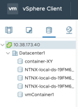

Storage Configuration
=====================

Overview
--------
In this lab we will use Prism to perform a basic storage container setup.

Storage Containers (usually just referred to as “containers”) are software-defined, logical constructs for managing storage policy that greatly simplifies storage management. Containers are similar to datastores in ESXi, in fact for ESXi, containers are presented to ESXi servers (nodes) as standard NFS datastores.

Let’s use Prism Element to perform a basic container setup.

In **Prism > Storage, click Storage, click Table**, then **click + Storage Container**.

Use the following specifications **(with Advanced Settings selected)**, and **click Save**:

- **Name** - container-your-initials (eg. container-XY)
- **Storage Pool** – leave as default-storage-pool-nnnnnnnnnnnn
- **Advertised Capacity** - 5 GiB
- **Compression** - Enabled (inline 0 mins)
- **Deduplication** - Cache Only
- **Erasure Coding** – Disabled
- **Filesystem Whitelists** – leave blank

Because our hypervisor is ESXi the workflow will ask if we want to mount the new container as an ESXi datastore on all or some of our ESXi hosts (nodes) that make up the cluster.

You should select all ESXi hosts to mount to, click save and you will see messages flash up indicating success.

The new container will appear in the container table view.

In vCenter (instantly) the Nutanix container appears as an NFS datastore – you can go and see by logging into vCenter via your browser (credentials and IP address provided earlier).

You can create multiple containers with different policies.

.. note:: Containers do not reserve any actual disk space—they are policies with a soft limit that trigger alerts but do not stop new data from being written to the container.

Explore the configuration basics further.

Go back to the container you created above and edit it (high light your container and then click the pencil/Update link) **to add another 95 GiB** (for a total of 100 GiB) to the advertised capacity. Don’t forget to click Advanced Settings to see the field you need. While you’re in that window, what is the redundancy factor for the container you created in the first task?

The Capacity seen in the vCenter datastore screen may not change until you click the refresh link in vCenter.

.. note::

   This is how easy it is to instantly define storage for use with ESXi – there are no LUNs and it’s all non-disruptive.  It’s also standard in that you know exactly how to look at the newly defined datastores in vCenter.

Redundancy Factor
-----------------

We have discussed how Nutanix clusters handle data: reads, writes, CVM auto-pathing, data locality, intelligent tiering, and seamless VM migrations. While leveraging these features and capabilities, Nutanix clusters continuously monitor and handle data placement in order to optimize performance and allow clusters to maintain high availability during software upgrades and failures.
You can locate the redundancy level of containers and the cluster within Prism.

In **Prism > Home, click the green OK in the Data Resiliency Status box**. This opens the Data Resiliency Status window.
The picture above shows the Data Resiliency Status window, where you can see, for example, how many ZooKeeper node failures can be tolerated without impacting the cluster. Each service listed has a specific function in the cluster. Zookeeper nodes maintain the configuration of the cluster.
The RF of a cluster in Prism Element could be configured by clicking Redundancy State in the Gear menu.

.. note::

   For this exercise, please leave the redundancy factor configured as 2.

In **Prism > Gear menu, click Redundancy State**.

Takeaways
---------	
- The default cluster redundancy factor is set to 2. Clusters with a redundancy factor of 2 have about 1/2 of the total raw disk space as useable  (30 TB raw ~ 15 TB usable space) because there are two copies of the data kept.
- A ZooKeeper failures tolerable of 1 means that one component in the cluster (one CVM, one NIC, one disk, and so on) can be down without impacting data resiliency. A failures tolerable of 2 means two components in the cluster can be down without impacting data resiliency. The two components can be different types.
